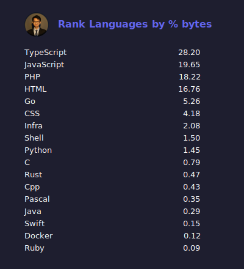
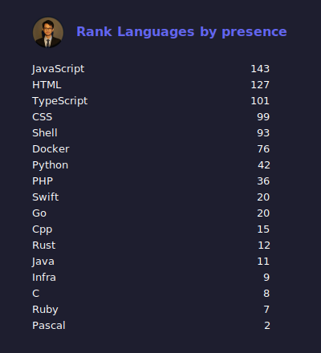

# 🧩 Github Private Stats
GitHub Private Stats is a personal project I built to analyze how many programming languages I've used across all my repositories — including public, private, and even organization private ones.

This project was inspired by [github-readme-stats](https://github.com/anuraghazra/github-readme-stats). While that project focuses on visualizing GitHub activity and stats, my goal is to create a tool that provides deeper insights — especially into private repositories that are usually excluded from public metrics.

I hope to keep improving it over time and eventually make it as powerful and customizable as github-readme-stats, but with full privacy and self-hosting support.
## ⚙️ Quick Setup

### 1. Clone Project
```shell
  git clone https://github.com/reyzeal/github-private-stats.git
```
### 2. Library & Dependency
#### bun
```shell
  bun install
```
### 3. Personal Access Token
Create `.env` file:
```dotenv
GITHUB_TOKEN=xxxx
GITHUB_USERNAME=reyzeal
```
### 4. Run script
```shell
    bun start
```

### 5. Result
Output files will be generated inside the `results` folder.
## 🔧 Features

### 🧮 Rank Top Languages by Size

### 📊 Rank Top Languages by Presence

